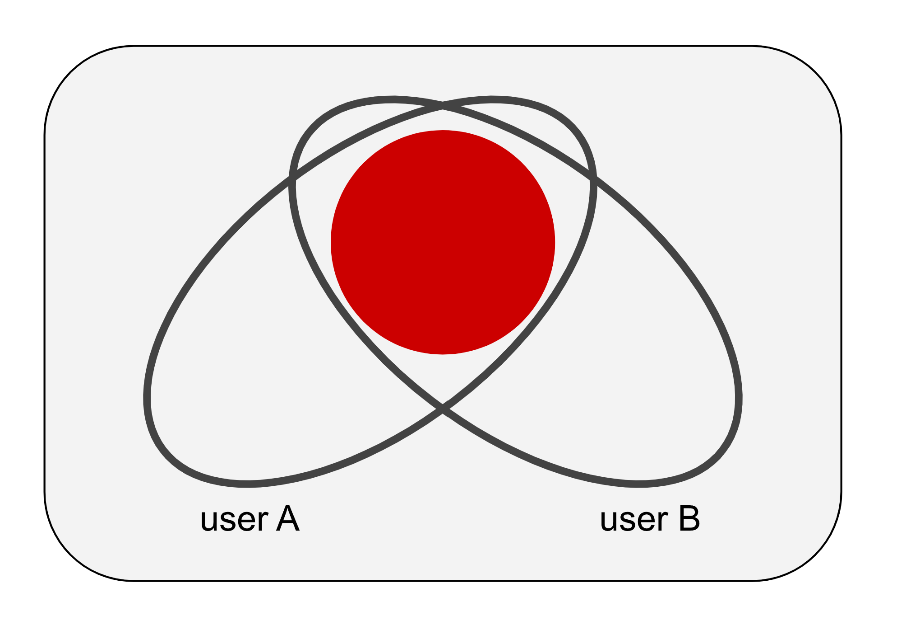
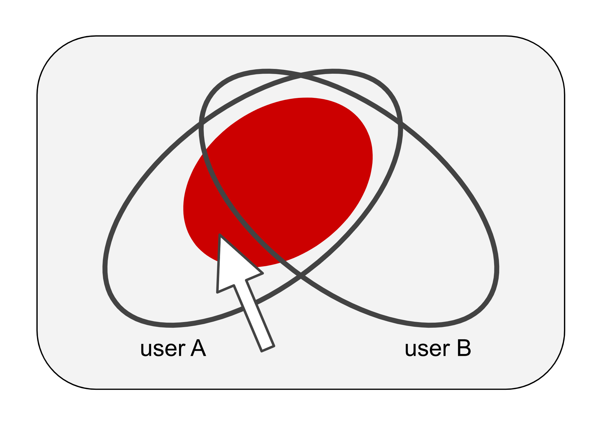
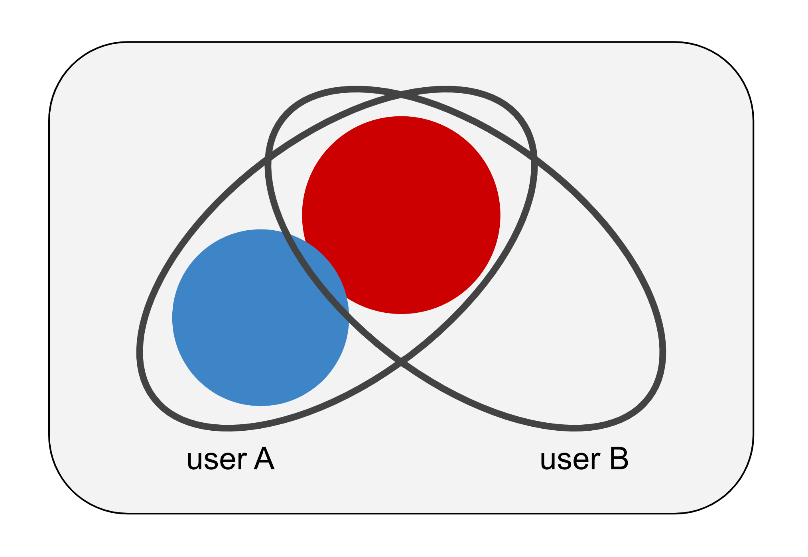

# How to contribute

If you want to add a domain, add 3 lines to `domain-list.yml` in the following format:

```yaml
- domain: 'example.com'
  evidence: https://example.com/12345/url-to-cheap-copy-of-stackoverflow-question
  original: https://stackoverflow.com/questions/12345
```

The corresponding changes in `uBlacklist.txt` and `evidence.md` will be automatically regenerated by GitHub Actions.

## Policy on accepting contributions

Thank you for your interest in improving ublacklist-stackoverflow-translation. In this document, we clarify the criteria to determine if particular domains should be added to ublacklist-stackoverflow-translation.

## How to determine whether to accept

We use the following criteria to determine if we should accept a contribution to add a domain to the exclusion list.

- It is considered that the domain consists of mechanically generate pages that are nothing more than machine translations of the content of [sites hosted by Stack Exchange](https://stackexchange.com/sites).
- The correspondence between the page generated by the machine translation and the original translated page is provided.

Note that "machine translation" contains identity transformation. This means that the domain that serves a copy of the content of the Stack Exchange is eligible for the exclusion list.

## Q. Can I add a domain (xxx.example.com) that serves machine-translated pages from a non-Stack Exchange site?

In addition to Stack Exchange, we recognize the fact that there are a number of sites that are considered to be serving machine-translated pages from other sites. We also recognize that a substantial percentage of the users of the exclusion list provided by this project would be in favor of blocking such sites. However, we are developing the exclusion list with a policy of not containing anything other than translated-SO in the scope of this project according to the policy described below. Therefore, xxx.example.com will not be included in this request.

If you find several such sites and they have consistent similarities, we suggest that you launch a new project in a separate repository. As an example, [ublacklist-github-translation](https://github.com/arosh/ublacklist-github-translation) is a new project resulting from the discussion in [#50](https://github.com/arosh/ublacklist-stackoverflow-translation/issues/50).

## Fundamental ideas

TL;DR We want to develop an exclusion list with fewer false positives.

No matter what appropriate exclusion list we develop, some users will feel that certain domains should be excluded while others will feel that they should not. In this project, we want to develop an exclusion list that contains only those domains that most users believe should be excluded **in common** (red circle) by a consistent acceptance policy.



Imagine that this project now contains domains that user B feels should not be excluded (pointed to by white arrows). User B may need to examine each item in the exclusion list one by one to develop a new exclusion list that partially omits the items in ublacklist-stackoverflow-translation. Since the items in ublacklist-stackoverflow-translation are added and removed through daily maintenance, the new exclusion list items may also need to be maintained continually.



On the other hand, user A can develop an ideal exclusion list for themselves by preparing an additional exclusion list (blue circle) that lists additional domains that they feel should be excluded. Even in this case, if ublacklist-stackoverflow-translation continues to maintain the exclusion list based on a consistent acceptance policy, they can delegate the maintenance of the exclusion list for areas that ublacklist-stackoverflow-translation is interested in. If the additional exclusion list is agreeable to a wide range of users, you may be able to launch a new project to maintain it in the community.



# 貢献の受け入れについての考え方

ublacklist-stackoverflow-translation の改善に興味を持ってくださりありがとうございます。このドキュメントは ublacklist-stackoverflow-translation に特定のドメインを追加するべきか判断するための基準を可能な限り明確に示すことを目的として作られたものです。

## 受け入れ基準

除外リストにドメインを追加する貢献を受け入れるべきかどうかの判断は、概ね以下の基準により実施されます。

- そのドメインが [Stack Exchange が運営するサイト群](https://stackexchange.com/sites) の内容を機械翻訳したに過ぎないページを機械的に生成していると考えられること
- 翻訳元となるページとの対応関係が明示できること

ただし「機械翻訳」には恒等変換を含みます。つまり Stack Exchange が運営するサイト群の内容をそのままコピーしたページを機械的に生成しているドメインも対象となる場合があります。

## Q. Stack Exchange 以外のサイトを機械翻訳しているドメイン (xxx.example.com) をこのプロジェクトの除外リストに含めることはできますか？

Stack Exchange 以外でも、あるサイトの内容を機械翻訳したに過ぎないページを機械的に生成していると考えられるサイトが多数存在している事実を認識しています。また、このプロジェクトが提供している除外リストの利用者のかなりの割合がこのようなサイトをブロックすることに賛同しているであろうことも認識しています。しかしながら、このプロジェクトは後述のポリシーにしたがって Stack Exchange を機械翻訳したサイトに特化させることにしています。よって xxx.example.com を除外リストに含めることはありません。

もしそのようなサイトが複数見つかり、それらに類似性がある場合は別のリポジトリで新しいプロジェクトを立ち上げることを勧めます。例として [ublacklist-github-translation](https://github.com/arosh/ublacklist-github-translation) は [#50](https://github.com/arosh/ublacklist-stackoverflow-translation/issues/50) での提案により生まれたプロジェクトです。

## 基本的な考え方

TL;DR このプロジェクトでは偽陽性が少ない除外リストを作ることに価値を見出しています

どのような優れた除外リストを作ったとしても、あるユーザーにとって特定のドメインは除外されるべきだと感じる一方で、別のユーザーにとっては除外されないべきだと感じることがあります。

このプロジェクトでは、一貫性のある受け入れ方針によって多くのユーザーが共通して除外するべきだと考えているドメイン群のみを含めた除外リスト（赤い円）を作成することに価値を見出しています。


このプロジェクトがユーザー B にとって除外されるべきでないと考えるドメイン群（白い矢印によって指されている）を含むようになった場合のことを想像してみてください。ユーザー B は購読している除外リストの内容を部分的に無効化した新しい除外リストを作るために、除外リストの項目を一つずつ精査する必要があるかもしれません。ublacklist-stackoverflow-translation の項目は日々のメンテナンスによって追加や削除が行われるため、新しい除外リストの項目も継続的にメンテナンスされる必要があるでしょう。


一方で、ユーザー A は追加で除外されるべきだと考えているドメインを列挙した新しい除外リスト（青い円）を準備することで自分にとって理想的な状態を作り上げることができます。この場合でも、ublacklist-stackoverflow-translation が一貫性のある受け入れ方針を維持できていればその関心領域の管理を ublacklist-stackoverflow-translation に委譲することができ、追加のリストのメンテナンスコストを削減することができるでしょう。もし追加の除外リストが多くのユーザーの共感を得られるものであれば、新しいプロジェクトとしてコミュニティでメンテナンスを継続することができるかもしれません。


