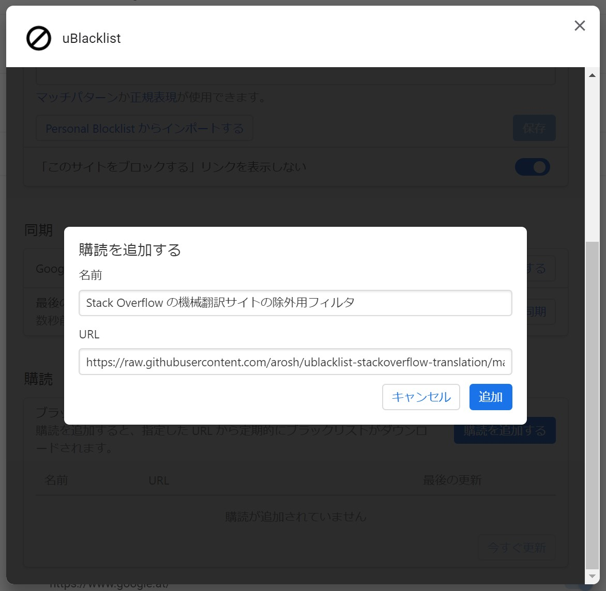

# uBlacklist Stack Overflow Translation

## Synopsis

Filter that enables excluding the machine-translated sites of Stack Overflow.

The domain list is in a format compatible with
[uBlacklist](https://github.com/iorate/uBlacklist), an extension that is
available for Google Chrome, Firefox, and browsers compatible with those
browsers.

## Usage

1. Install uBlacklist

- [Chrome Web Store](https://chrome.google.com/webstore/detail/ublacklist/pncfbmialoiaghdehhbnbhkkgmjanfhe)
- [Firefox Add-ons](https://addons.mozilla.org/en-US/firefox/addon/ublacklist/)

2. Open the uBlacklist configuration page
   (`chrome://extensions/?options=pncfbmialoiaghdehhbnbhkkgmjanfhe`), and then
   click "Add a subscription"

3. In the dialog that appears, copy and paste as follows, and then click "Add"

| Key  | Value                                                                                              |
| ---- | :------------------------------------------------------------------------------------------------- |
| Name | Filter that enables excluding the machine-translated sites of Stack Overflow                       |
| URL  | https://raw.githubusercontent.com/arosh/ublacklist-stackoverflow-translation/master/uBlacklist.txt |

## Acknowledgements

[@iorate](https://github.com/iorate) - for creating an exceptional extension
[uBlacklist](https://github.com/iorate/uBlacklist)

## Related links

- [iorate/uBlacklist: Blocks specific sites from appearing in Google search results](https://github.com/iorate/uBlacklist)
- [Personal Blocklist の代替になりそうな Chrome 拡張機能を作ってみた - Qiita](https://qiita.com/iorate/items/9ff65360fbdf4082476a)
- [Stack Overflow の英語から日本語に機械翻訳されたコンテンツのサイトについてどう思いますか？ \- スタック・オーバーフロー Meta](https://ja.meta.stackoverflow.com/questions/2905/stack-overflow%E3%81%AE%E8%8B%B1%E8%AA%9E%E3%81%8B%E3%82%89%E6%97%A5%E6%9C%AC%E8%AA%9E%E3%81%AB%E6%A9%9F%E6%A2%B0%E7%BF%BB%E8%A8%B3%E3%81%95%E3%82%8C%E3%81%9F%E3%82%B3%E3%83%B3%E3%83%86%E3%83%B3%E3%83%84%E3%81%AE%E3%82%B5%E3%82%A4%E3%83%88%E3%81%AB%E3%81%A4%E3%81%84%E3%81%A6%E3%81%A9%E3%81%86%E6%80%9D%E3%81%84%E3%81%BE%E3%81%99%E3%81%8B)
- [Google の検索結果から機械翻訳でおかしな日本語に翻訳されている Q&A サイトを非表示にする – Ewig Leere\(Lab2\)](https://labor.ewigleere.net/2019/04/03/extension-exclude-to-faqservice-from-google-search/)
- [Taraflex/Back2stackoverflow: Userscript for redirect to stackoverflow.com from machine-translated sites](https://github.com/Taraflex/Back2stackoverflow)

## License

[Creative Commons Zero v1.0 Universal](LICENSE)
