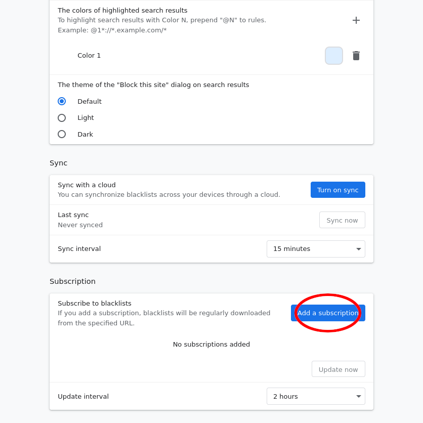
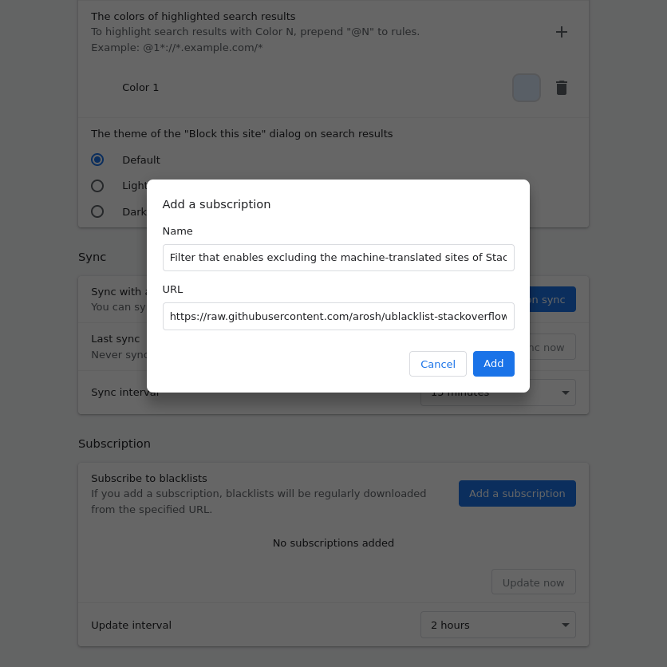
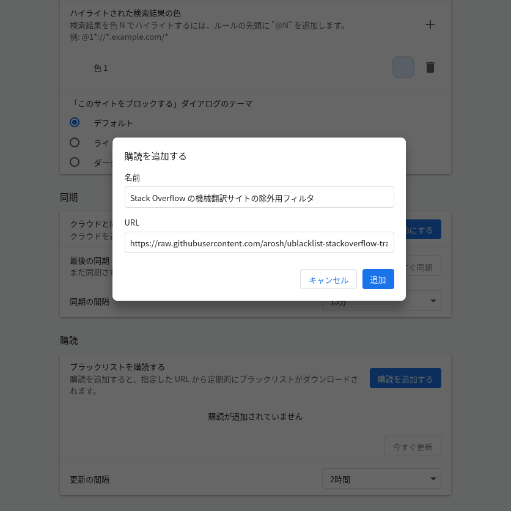

# uBlacklist Stack Overflow Translation

（日本語版の説明が下半分にあります）

## Synopsis

Exclude domains from Google search that serve machine-translated sites of Stack Exchange.

Provided filter can be subscribed by [uBlacklist](https://github.com/iorate/uBlacklist), which is a browser extension available for Google Chrome, Firefox, and others.

## Usage

1. Install uBlacklist

- [Chrome Web Store](https://chrome.google.com/webstore/detail/ublacklist/pncfbmialoiaghdehhbnbhkkgmjanfhe)
- [Firefox Add-ons](https://addons.mozilla.org/en-US/firefox/addon/ublacklist/)

2. Open the uBlacklist configuration page, and then click "Add a subscription"

3. In the dialog that appears, copy and paste as follows, and then click "Add"

| Key  | Value                                                                                              |
| ---- | :------------------------------------------------------------------------------------------------- |
| Name | Filter that enables excluding the machine-translated sites of Stack Overflow                       |
| URL  | https://raw.githubusercontent.com/arosh/ublacklist-stackoverflow-translation/master/uBlacklist.txt |

## Acknowledgements

[@iorate](https://github.com/iorate) - for creating an exceptional extension
[uBlacklist](https://github.com/iorate/uBlacklist)

## Related projects

* [arosh/ublacklist-github-translation](https://github.com/arosh/ublacklist-github-translation)

## Related links

- [iorate/uBlacklist: Blocks specific sites from appearing in Google search results](https://github.com/iorate/uBlacklist)
- [Personal Blocklist の代替になりそうな Chrome 拡張機能を作ってみた - Qiita](https://qiita.com/iorate/items/9ff65360fbdf4082476a)
- [Stack Overflow の英語から日本語に機械翻訳されたコンテンツのサイトについてどう思いますか？ \- スタック・オーバーフロー Meta](https://ja.meta.stackoverflow.com/questions/2905/stack-overflow%E3%81%AE%E8%8B%B1%E8%AA%9E%E3%81%8B%E3%82%89%E6%97%A5%E6%9C%AC%E8%AA%9E%E3%81%AB%E6%A9%9F%E6%A2%B0%E7%BF%BB%E8%A8%B3%E3%81%95%E3%82%8C%E3%81%9F%E3%82%B3%E3%83%B3%E3%83%86%E3%83%B3%E3%83%84%E3%81%AE%E3%82%B5%E3%82%A4%E3%83%88%E3%81%AB%E3%81%A4%E3%81%84%E3%81%A6%E3%81%A9%E3%81%86%E6%80%9D%E3%81%84%E3%81%BE%E3%81%99%E3%81%8B)
- [Google の検索結果から機械翻訳でおかしな日本語に翻訳されている Q&A サイトを非表示にする – Ewig Leere\(Lab2\)](https://labor.ewigleere.net/2019/04/03/extension-exclude-to-faqservice-from-google-search/)
- [Taraflex/Back2stackoverflow: Userscript for redirect to stackoverflow.com from machine-translated sites](https://github.com/Taraflex/Back2stackoverflow)

## License

[Creative Commons Zero v1.0 Universal](LICENSE)

# Stack Overflow の機械翻訳サイトの除外用フィルタ

## 概要

Stack Overflow の機械翻訳に過ぎないサイトを Google 検索の結果から除外するためのフィルタです。

Google Chrome および Firefox の拡張機能である [uBlacklist](https://github.com/iorate/uBlacklist) で購読可能な書式で記載しています。

## 使い方

1. uBlacklist をインストールします。
  * [Chrome Web Store](https://chrome.google.com/webstore/detail/ublacklist/pncfbmialoiaghdehhbnbhkkgmjanfhe)
  * [Firefox Add-ons](https://addons.mozilla.org/en-US/firefox/addon/ublacklist/)
2. uBlacklist の設定画面を開いて「購読を追加する」をクリックします。

3. 表示されたダイアログで以下のように入力して「追加」をクリックします。

| 項目 | 内容 |
| ---- | :------- |
| 名前 | Stack Overflow の機械翻訳サイトの除外用フィルタ |
| URL  | https://raw.githubusercontent.com/arosh/ublacklist-stackoverflow-translation/master/uBlacklist.txt |

## 謝辞

素晴らしい拡張機能である [uBlacklist](https://github.com/iorate/uBlacklist) の作者の [@iorate](https://github.com/iorate) 氏に感謝いたします。

## 関連プロジェクト

* [arosh/ublacklist-github-translation](https://github.com/arosh/ublacklist-github-translation)

## 関連リンク

* [iorate/uBlacklist: Blocks specific sites from appearing in Google search results](https://github.com/iorate/uBlacklist)
* [Personal Blocklist の代替になりそうな Chrome 拡張機能を作ってみた - Qiita](https://qiita.com/iorate/items/9ff65360fbdf4082476a)
* [Stack Overflowの英語から日本語に機械翻訳されたコンテンツのサイトについてどう思いますか？ \- スタック・オーバーフローMeta](https://ja.meta.stackoverflow.com/questions/2905/stack-overflow%E3%81%AE%E8%8B%B1%E8%AA%9E%E3%81%8B%E3%82%89%E6%97%A5%E6%9C%AC%E8%AA%9E%E3%81%AB%E6%A9%9F%E6%A2%B0%E7%BF%BB%E8%A8%B3%E3%81%95%E3%82%8C%E3%81%9F%E3%82%B3%E3%83%B3%E3%83%86%E3%83%B3%E3%83%84%E3%81%AE%E3%82%B5%E3%82%A4%E3%83%88%E3%81%AB%E3%81%A4%E3%81%84%E3%81%A6%E3%81%A9%E3%81%86%E6%80%9D%E3%81%84%E3%81%BE%E3%81%99%E3%81%8B)
* [Googleの検索結果から機械翻訳でおかしな日本語に翻訳されているQ&Aサイトを非表示にする – Ewig Leere\(Lab2\)](https://labor.ewigleere.net/2019/04/03/extension-exclude-to-faqservice-from-google-search/)
* [Taraflex/Back2stackoverflow: Userscript for redirect to stackoverflow.com from machine-translated sites](https://github.com/Taraflex/Back2stackoverflow)

## ライセンス

[Creative Commons Zero v1.0 Universal](LICENSE)
